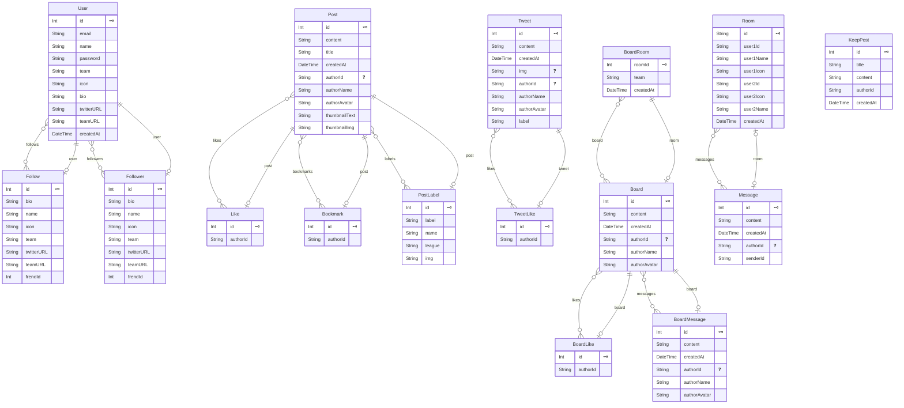

# TOKOTOKO=J


<br />

- 10年間国内サッカーリーグを応援し続けた私が、今後もっと**国内サッカーリーグを盛り上げるため**に作成したSNSアプリ。
- 制作期間約2~3か月

https://tokotokoj.vercel.app

**テストユーザー** 
+ 右上のユーザーアイコンからログインできます。
+ ログインすると**いいね機能、フォロー機能、投稿機能、そしてMYPAGE**が確認できます。
```
[email] test.user2023@gmail.com
[password] 123456
```
# TOKOTOKO=Jとは？
- **国内サッカーリーグ(Jリーグ)専用SNSアプリです。**
- 国内サッカーリーグ(Jリーグ)と他の国内スポーツリーグの違いは**各地域に沢山のチームがあることだ(58チーム)**。そのため**地方に遠征に行くことが国内サッカーリーグ(Jリーグ)の醍醐味**とも言える。各地域にトコトコ足を運び、【思い出が投稿・共有できるよ様にしたい】、【もっとスタジアムに足を運んでほしい】言う願いから**TOKOTOKO=J**と命名した。
  
## きっかけ
- 国内サッカーリーグを10年間応援し続け、**サッカー専用**のSNSアプリがないと感じた。サッカーファンが使用しているSNSはチーム専用の掲示板やX(旧 Twitter)やInstagramなど分散しているのが現状だ。そして **様々な種類の投稿機能(ブログ形式投稿、短文投稿、画像付き投稿)** 全てを備えているものがない。
- **サッカーを応援している人口は多い。これらの機能を一つにまとめたら最高のSNSアプリが作れる**、そしてもっと国内サッカーリーグ(Jリーグ)を活性化できると思った。

## 目指した課題解決
- チームの情報を共有しやすくする。それにより**応援の熱を活性化させ、チームを盛り上げる**。
- 情報を共有により、各地域の情報を確認しやすくし、**地方に試合を見に行くことの難易度を下げたい。**
- 他のチームの人々との繋がりを深めることを助け、**国内サッカーリーグ(Jリーグ)を盛り上げたい。**
  
**【情報の共有のし易さ・情報の検索のし易さ・繋がり易さ】を課題解決の軸として開発した。**

## 技術選定・使用技術
技術選定を行った際の基準は、【円滑な開発】である。
 - ここでの【円滑な開発】は、エラーや不明点があった際に**解決の糸口を自分で探すことができる技術であることだ**。</br>
 - 歴が1年と短く、日々新たなものに触れる状況。その中で「新たに登場したライブラリだから」「人気と言われているから」などの**軽薄な理由での技術選定は開発を円滑に進めることは困難になる**と考えた。
</br>

以上の基準を元に下記の技術選定を行った。

<br />

### フロントエンド
 これまだ一番長く触れてきたReactをベースとしたNext.jsで作成した。**Next.jsはページ遷移の速さ・pathの指定のし易さなど機能面での優位点**がReact単体よりもあるほか、現在の長期インターンシップ先で使用していることから、**実務に沿ったプロダクト開発を行えると考えた。** グローバルstateを管理するために**Redux**を選んだ。選定の段階でReduxか **【useContext使ったstateの管理】** の2点を検討した。今回のプロダクト規模ではuseContextで十分であるとも検討したが、今後**新しい機能追加の際やリプレイス**を考えた時に、自身にとって【使い易く】・【フォルダの管理がし易い】という2点からReduxを選定した。

### バックエンド
バックエンド技術選定を行う際に選択肢として、**Node.jsとRuby(Ruby on Rails)** があった。しかし今回の技術選定の全体の軸として【円滑な開発】としていたため、フロント側でも使用しているTypeScriptを使用できる**Node.js**を選択した。そして今回のプロダクトは**フォルダ数、データベース**ともにこれまで自身で開発していたものと比べ、複雑になってしまうことが想定できた。これまでFirebaseなどのNoSQLを使用した開発を行っていたが、今回はプロダクトの大きさやデータベースの複雑性を予想し、**RDBで設計を行うこと**にした。そしてこれまで使用経験が多い**Prisma**を使い、RDBを設計した。


|     言語・ライブラリ      | バージョン・用途                                   |
| ----------------- | --------------------------------------------------   |
| TypeScript        | v 5.2.2             |
| React           　 | v 18.2.0                      |
| Redux    　　　　　 | v 8.1.2     グローバルな状態管理                |
| react-hook-form   | v 7.45.4     ログイン時などのバリデーションチェック           |
| react-markdown    | v 8.0.7        投稿する際にmarkdownで記入する      |
| axois          　　| v 1.4.0               fetch処理                            |
| Next.js        　　| v 13.4.7 (App Routerで作成していません。)                    |
|  Node.js          | v 18.14.0 (TypeScriptを使用しています。)                                            |
| Express.js        | v 4.18.2                                    |
| Prisma            | v 5.3.1                RDBで管理するため                   |
| JSON Web Token    | v 9.0.2           認証管理の際に使用           |
| bcrypt            | v 5.1.1          認証管理の際に使用            |
| EsLint            | v 8.48.0 (import orderなどの設定を行っています。)  |
| Scss              |v 1.63.6   |
| Material UI       |v 5.14.11  |
| Supabase          | supabaseを使用し、PostgreSQLでデータを管理 |
| Vercel            | フロントエンドのデプロイ先 |
| Render            |バックエンドのデプロイ先 |
| Jest, testing-library   |テストツール、ページの主要なfetch処理をテストしています(SSRなど) |

<br />

## フォルダ構成
### フロントエンド
```
src/
├─ componets
│    ├─ hooks             # カスタムフック
│    ├─ layout            # ページ共通のレイアウト
│    ├─ parts              # 最小単位の再利用可能コンポーネント (Buttonなど)
│    ├─template           # ページの主要部分
│    ├─ widgets           # ページの一部分の再利用可能コンポーネント (同じデザインfooterなど)
│
├─ pages                  # ページ遷移用（componets配下のファイルをインポート。fetch処理やSSRを含む。）
│              
├─ features               # Reduxのsliceを各機能ごとに記述。
│      ├─ chatSlice.ts
│      ├─ postSlice.ts
│      ├─ userSlice.ts
│
├─ store                  # Reduxのstoreを記述
├─ libs                   # ライブラリの初期設定
├─ utils                  # 再利用可能な関数 (時間のフォーマット形成など)
├─ style                  # レイアウトやMaterial UIのCSS
└─ types                  # Props以外の型定義

```
フォルダ構成の軸としたものが**機能ごとの分割**だ。
プロジェクト全体の見通しを良くすることで、**同じような機能の再実装を防げたり、修正の際の影響範囲を簡単に見積もること**ができるようにする。
+ pagesにSSRなどのレンダリング時のfetch処理を集約させた。 pagesに**初回レンダリング時のfetch処理以外**を書かないことで、fetch処理と実際のページを分割している。
+ componets配下に機能ごとのフォルダを設置。(**再利用が可能なもの**は、partとwidgetsに記述、**実際のページの核**となる部分はtemplateに記述。)
+ templateには書く**pathごと**にフォルダを設置。

### バックエンド
```
src/
├─ Prisma             
├─ src
│    ├─ server.ts        # サーバー起動・ルーティング設定を記述
│    ├─ middleware.ts    # ログインの際の処理を記述
│    ├─ router            
│    │  ├─ article       # ホームページで使用するAPIを記述
│    │  ├─ board  　　　　# 掲示板ページで使用するAPIを記述
│    │  ├─ chat          # chatページで使用するAPIを記述
│    │  ├─ post          # 投稿されたデータを処理するAPIを記述

```



フロント側と同じ様にフォルダ構成の軸としたはが**機能ごとの分割**だ。
APIを使用している部分ごとに分けることで、**APIの発見のしやすさ、修正の際の影響範囲を簡単に見積もること**を可能にする。
コードの質を上げるためにも、似たAPIをフォルダごとに集約することができる。
+ srcフォルダ配下に各機能ごとのserver.tsとrouterフォルダを設置。

# 機能詳細とポイント

+ 本プロダクトは主に**4つのページ**で構成されています。(HOME, CHAT, MYPAGE, BOARD)
+ ページごとの**概要**と**注力した点(ポイント)** と **その他の機能**を説明しています。
+ 4つの基本ページ以外のページは**その他**でまとめて紹介しています。

## HOME画面 (ホーム)

| 全体 |　ポイント　|
| ---- | ---- |
|  |  
| TOKOTOKO=Jでは投稿には2つの種類があります。ホーム画面では、Tweet投稿とAlbum投稿が**いいねの多い順**に、そして投稿に設定できる**Labelが多いチーム**が表示されます。  | 一度全てのlabel情報を取得し、labelの登場回数が多い順に並び替え、重複しているlabelを削除しています。**人気順に並べることで今話題のチームや情報を迅速に確認できます。** |

| その他 (UX) |　その他 (レスポンシブ) |
| ---- | ---- |
|  |  
|**情報量の多さはUXが下がると思いました。** Tweetの場合本文の一部を表示させ、詳細はModalで表示されます。 | **レスポンシブ対応(375px~)** もしており、スマートフォンなどの小さな画面でも快適に投稿された内容を確認できる様になっています。 |

## CHAT (チャット)

| 全体 |　詳細|
| ---- | ---- |
|  |  |
| CHATページでは**同じチームを応援している人、違うチームだけど仲良くなりたい人**と繋がれることができます。**フォローしたユーザーに対してのみ**メッセージを送ることができます。 | 相互フォローしていない相手からメッセージが送られてきた際に、**通知される挙動**にしています。この部分は**全ページの中で特に苦戦した部分**です。相手のフォロー状態と自分のフォロー状態の確認、ボタンが押された際には相手のデータに反映させるなど様々な条件式を組み合わせて作成しています。 |

| その他(デザイン) |　その他(レスポンシブ) |
| ---- | ---- |
| |   |
| **自分の送った内容の時は右側**に、**相手が送信した内容は左側**に表示されるようになっています。| **レスポンシブ対応(375px~)** もしており、スマートフォンなどの小さな画面でも快適に投稿された内容を確認できる様になっています。**SideBar部分**が下から表示されるようになっています。 |

## BOARD (掲示板)

| 全体 | ポイント　|
| ---- | ---- |
|  |  |
| サッカーにおいて**主要なSNSツールは掲示板**です。しかし現在ある掲示板はUIが悪く、UXが低いです。今回作成したBOARD(掲示板)はシンプルかつ使いやすい様にしました。| 現在のサッカーの掲示板では対戦相手のチームのファンによる荒らしが多く、本来の機能を果たしていません。この掲示板は**自身の登録したチームにのみアクセスできる様**になっています。 |

| その他(返信機能) |　その他(レスポンシブ) |
| ---- | ---- |
|  | |
 一つの投稿に対して**話題を深掘りできる様**に、一つの投稿に対しても返信を行えるようにしています。 | **レスポンシブ対応(375px~)** もしており、スマートフォンなどの小さな画面でも快適に投稿された内容を確認できる様になっています。 |

## MYPAGE (掲示板)

| 全体 | ポイント　|
| ---- | ---- |
|  |  |
| MYPAGEでは**二種類の投稿(TweetとAlbum)、自身のプロフィール編集、そして保存・いいね・自身が投稿した投稿を一覧**できます。2種類の投稿(Tweet投稿とAlbum投稿)のうち、**Album投稿**しかMYPAGEのTabには掲載されません。| Tabでは保存・いいね・自身が投稿した投稿を切り替えできます。Tabを切り替えるごとに即座に反映される様に実装しています。 |

| その他(プロフィール編集機能) |　その他(投稿機能) |
| ---- | ---- |
|  | |
| プロフィールの編集を行えるようにしています。**名前・紹介文・プロフィール画像変更**の他、**X(旧 Twitter)や自信が応援しているチームのホームページ**を登録することができます。 | 右下のボタンをhoverすると二つのボタンが出現します。このボタンは**投稿ボタン**です。ここから投稿ページに遷移します。(本プロダクトでは二種類の投稿機能があります。Tweet投稿とAlbum投稿です。下記で詳細に説明しています。) |

## その他のページ
| Album投稿ページ | ポイント　|
| ---- | ---- |
|  |   |
|二つある投稿機能のうち**Album投稿**です。Album投稿はMarkDown形式で記入し、画像などの挿入の可能です。**Album投稿はBlogの様に書くことを想定**しています。例えば、地方に遠征に行った際の出発から帰宅までの一覧の流れを書く、最近話題になっているサッカーニュースについて自分の意見を詳細に書くことができます。| Album投稿ページには様々な機能があります。上記の画像は一時保存されていない状態で戻るボタンを押した際に**SaveBarが降りてくる様**になっています。他にも**一時保存機能**やマークダウン記述をその場で確認できる**プレビュー機能**などもついています。 |


| Tweet投稿ページ |　ポイント |
| ---- | ---- |
|  |  |
| 二つある投稿機能のうち**Tweet投稿**です。Tweet投稿は短文と画像を投稿するのに適しています。Labelを設定することができ、検索の際にヒットしやすくすることができます。 | 本プロダクトの特徴はLabelを追加できることです。他のSNSアプリの場合、チームごとの検索が難しいと感じています。特に短文を投稿する場合などは簡単に投稿できることを重きをおいており、投稿の検索などは困難です。本プロダクトの **Tweet投稿**では簡単に投稿できることはもちろんのこと、Labelを追加できるため、**自分の興味を持った投稿を検索しやすくなっています。**|

| 投稿一覧ページ(Album) |　ポイント |
| ---- | ---- |
|  |  |
| 投稿されたAlbumを一覧ページで確認することができます。表示方法には**文字検索・Label検索・投稿順・いいね順**に表示することができ、変更内容を即座に確認することができます。 |  **レスポンシブ対応(375px~)** もしており、スマートフォンなどの小さな画面でも快適に投稿された内容を確認できる様になっています。そして投稿が多い際には表示枚数を制限し、**ページネーションで次の投稿一覧を確認すること**ができます。 |

| 投稿一覧ページ(Tweet) |　ポイント |
| ---- | ---- |
|  |  |
| 投稿されたTweetは一覧ページで確認することができます。表示方法には**文字検索・投稿順・いいね順**に表示することができ、変更内容を即座に確認することができます。(**Label検索はAlbum投稿飲み**) |  **レスポンシブ対応(375px~)** もしており、スマートフォンなどの小さな画面でも快適に投稿された内容を確認できる様になっています。そして投稿が多い際には表示枚数を制限し、**ページネーションで次の投稿一覧を確認すること**ができます。 |

| チーム検索ページ |　ポイント |
| ---- | ---- |
|  |  | 
|  **チーム検索画面**です。現在は一つのカテゴリーに所属するチームしか登録していません。しかし今後、**国内サッカーリーグに所属する全チーム**を登録したいと考えています。| チーム数が多いため、検索機能をつけました。**検索したチームをロゴをクリックするとそのチームに関連したAlbum一覧ページに遷移します。** |

# 工夫した点・今回の反省と今後の展開
## 工夫した点
 **今後チーム開発に規模を拡大しても適用可能なクリーンなコードを意識**することだ。
   - **cssや関数間の改行**
   - **関数やフォルダの一貫した命名(パスカルケース,スネークケース,キャメルケース)**
   - **再利用できるコンポーネントの作成 (componetsフォルダ配下のpartsフォルダやwidgetsフォルダ)**
   - **カスタムフックの作成 (componetsフォルダ配下のhooksフォルダ)**
   - **props以外の型定義の集約**
   - **EsLintを使用したimport orderなどの設定**

## 今回の反省と今後の展開
+ 要件定義
  + フロントエンド、バックエンドともに**要件定義を疎かにしてしまった。**
  + 作業途中での足りない機能追加などを行ってしまい、その機能が他のコンポーネントとの依存関係に影響を与えた。今後の対策として**要件の洗い出しの質の向上**、そして追加の機能がある際には他のコンポーネントに与える影響など単一的な視点になるのではなく**多角的な視点**を常に持つ。
+ 設計
  + フロント側の設計、DB設計を疎かにしてしまった。それは**設計に費やすコストは最小限にして、開発に費やすコストを上げようとした考えたため**だ。
  + しかし、この行動は裏目に出た。開発時に多くの問題が発生し、作業効率が下がった。
  +  画面設計を正確に行なっていれば不要なコンポーネント作成やレイアウトのずれ、開発途中でのスキーマ変更などを行わなくて済みんだ。設計は開発の基盤であり、疎かにしてはいけない。

</br>

  **上記のように、開発前の要件定義や設計などの開発作業前の品質向上が課題であると考える。ただし、要件定義や設計を実施する機会は頻繁に訪れるわけではない。普段から開発を行う際、現在の仕様に至った経緯や背景を確認、意識しながら開発を行う必要だ。**
  
</br>

+ 保守性向上
  + テストコードの質が低く、運用する上で**保守性が低い**。
  + リファクタリングや仕様変更を行う際の**一つの指標となるため**にもテストコードの質の向上が求められる。
+ API
  + REST APIのデメリット面である不必要なデータの取得やメモリリークの影響を、多くのfetch処理、そして画像を含めたデータの処理を行っている分多く受けている。
  + その対策として、リプレイスの際は【使用経験のある**GraphQLを使用した処理**などの新しい技術を取り入れる】、【画像データを軽量化する処理を行う】必要がある。
  + 使いこなせない新しい技術は効果を発揮しない。メリット・デメリットの理解や与える影響の範囲などを考える必要がある。

  
