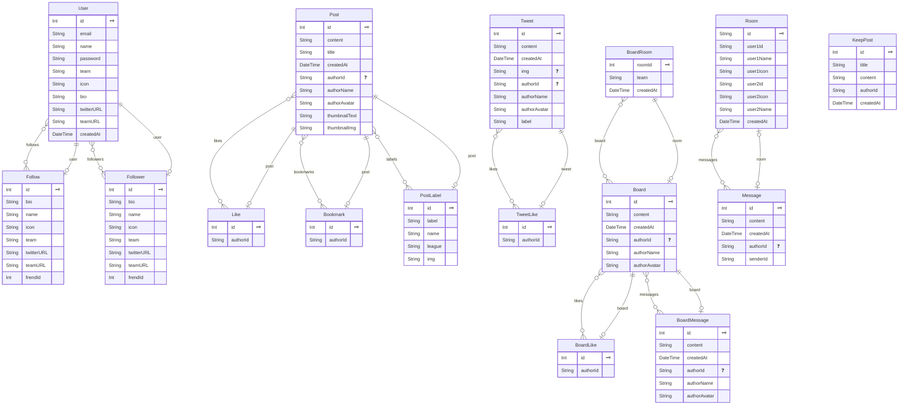

```mermaid
erDiagram

  "User" {
    Int id "🗝️"
    String email 
    String name 
    String password 
    String team 
    String icon 
    String bio 
    String twitterURL 
    String teamURL 
    DateTime createdAt 
    }
  

  "Follow" {
    Int id "🗝️"
    String bio 
    String name 
    String icon 
    String team 
    String twitterURL 
    String teamURL 
    Int frendId 
    }
  

  "Follower" {
    Int id "🗝️"
    String bio 
    String name 
    String icon 
    String team 
    String twitterURL 
    String teamURL 
    Int frendId 
    }
  

  "Post" {
    Int id "🗝️"
    String content 
    String title 
    DateTime createdAt 
    String authorId "❓"
    String authorName 
    String authorAvatar 
    String thumbnailText 
    String thumbnailImg 
    }
  

  "Like" {
    Int id "🗝️"
    String authorId 
    }
  

  "Bookmark" {
    Int id "🗝️"
    String authorId 
    }
  

  "PostLabel" {
    Int id "🗝️"
    String label 
    String name 
    String league 
    String img 
    }
  

  "Tweet" {
    Int id "🗝️"
    String content 
    DateTime createdAt 
    String img "❓"
    String authorId "❓"
    String authorName 
    String authorAvatar 
    String label 
    }
  

  "TweetLike" {
    Int id "🗝️"
    String authorId 
    }
  

  "BoardRoom" {
    Int roomId "🗝️"
    String team 
    DateTime createdAt 
    }
  

  "Board" {
    Int id "🗝️"
    String content 
    DateTime createdAt 
    String authorId "❓"
    String authorName 
    String authorAvatar 
    }
  

  "BoardLike" {
    Int id "🗝️"
    String authorId 
    }
  

  "BoardMessage" {
    Int id "🗝️"
    String content 
    DateTime createdAt 
    String authorId "❓"
    String authorName 
    String authorAvatar 
    }
  

  "Room" {
    String id "🗝️"
    String user1Id 
    String user1Name 
    String user1Icon 
    String user2Id 
    String user2Icon 
    String user2Name 
    DateTime createdAt 
    }
  

  "Message" {
    Int id "🗝️"
    String content 
    DateTime createdAt 
    String authorId "❓"
    String senderId 
    }
  

  "KeepPost" {
    Int id "🗝️"
    String title 
    String content 
    String authorId 
    DateTime createdAt 
    }
  
    "User" o{--}o "Follower" : "followers"
    "User" o{--}o "Follow" : "follows"
    "Follow" o|--|| "User" : "user"
    "Follower" o|--|| "User" : "user"
    "Post" o{--}o "PostLabel" : "labels"
    "Post" o{--}o "Like" : "likes"
    "Post" o{--}o "Bookmark" : "bookmarks"
    "Like" o|--|| "Post" : "post"
    "Bookmark" o|--|| "Post" : "post"
    "PostLabel" o|--|| "Post" : "post"
    "Tweet" o{--}o "TweetLike" : "likes"
    "TweetLike" o|--|| "Tweet" : "tweet"
    "BoardRoom" o{--}o "Board" : "board"
    "Board" o{--}o "BoardLike" : "likes"
    "Board" o{--}o "BoardMessage" : "messages"
    "Board" o|--|| "BoardRoom" : "room"
    "BoardLike" o|--|| "Board" : "board"
    "BoardMessage" o|--|| "Board" : "board"
    "Room" o{--}o "Message" : "messages"
    "Message" o|--|o "Room" : "room"
```
